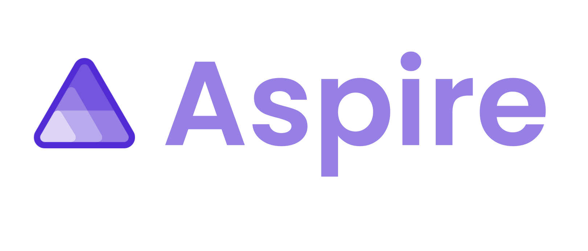

<a name="start-building"></a>
<br>
<p align="center">

</p>

# [Microsoft Build 2026](https://build.microsoft.com)

## BRK205: Aspire for agents: Transform how you build and deploy distributed apps

<a href="https://aspire.dev"></a>

[Aspire](https://aspire.dev) is an agent-ready, code-first tool to compose, debug, and deploy any distributed app. It makes it easier to build, run, debug, and deploy services across any language, stack, or cloud. It’s free and open source at [github.com/microsoft/aspire](https://aka.ms/aspire/build26/aspire-repo?utm_source=build-brk205-related-aspire-github-repo-cta&utm_medium=event&utm_campaign=msbuild-2026).

**Aspire 13.4 is here!**
- Get Aspire 13.4: [get.aspire.dev](https://get.aspire.dev)
- Read our ["What's New" blog](https://aka.ms/aspire/build26/whats-new/blog?utm_source=build-brk205-related-aspire-whats-new-blog-cta&utm_medium=event&utm_campaign=msbuild-2026) and [release notes](https://aka.ms/aspire/build26/whats-new/docs?utm_source=build-brk205-related-aspire-release-notes-cta&utm_medium=event&utm_campaign=msbuild-2026).

This repo is your companion for the **BRK205** session at Microsoft Build 2026. Dive in and start building with Aspire today!

In this session, we explore two sides of the **Aspire + agents** story:

1. **Building with coding agents** — Use AI coding agents (like GitHub Copilot) to build, debug, and deploy distributed apps. The Aspire CLI, OpenTelemetry dashboard, skills, and structured app model give agents the context they need to understand and operate your entire stack.
2. **Building agentic apps** — Use the Microsoft Foundry integration to orchestrate and deploy intelligent, agent-powered applications as part of your distributed system. See how you can go from local development to cloud deployment with the same model. 

### ✨ Why Aspire?

- 🧩 **Code-centric control** — Define your entire stack in code. Type-safe, readable, and deployable anywhere.
- 🔭 **Observability from the start** — Built-in OpenTelemetry gives you logs, traces, and health checks automatically.
- 🚀 **Flexible deployments** — Kubernetes, cloud, on-prem — Aspire adapts to your environment.
- 🤖 **Agent-ready** — Aspire is the control plane for agentic dev. AI coding agents use your app model and the Aspire CLI to understand, build, and operate your entire stack.
- 🌍 **Multi-language** — Works with C#, JavaScript, TypeScript, Python, Java, Go, and more.

Learn more on our website [Aspire.dev](https://aspire.dev) and read the [Aspire FAQ](https://aspire.dev/get-started/faq/).

### 🏫 Materials from the session

- [**Build BRK205 Session Page**](https://build.microsoft.com/en-US/sessions/BRK205?source=sessions) — includes session recording, transcript, presentation deck, and other relevant details.
- [**Build 2026 Aspire agents demo**](https://github.com/microsoft/Build26-BRK205-aspire-for-agents-transform-how-you-build-and-deploy-distributed-apps/tree/main/src) — a repo for the compact Build 2026 demo for the thesis: Aspire gives developers and agents a shared, executable model of the app.


### 🧠 Learning outcomes

By the end of this session, you will be able to:

- Understand how Aspire's agent-ready architecture helps coding agents build, debug, and deploy distributed apps
- Use the Aspire CLI, dashboard, and skills to give AI agents deep context about your application
- Build agentic applications using Aspire's Microsoft Foundry integration
- Model multi-service architectures using the AppHost and deploy them confidently

### 🏠 Getting started on your own

Ready to try Aspire? Here's the quickest path to your first app:

1. **Install the Aspire CLI**
   ```bash
   # Bash
   curl -sSL https://aspire.dev/install.sh | bash

   # PowerShell
   irm https://aspire.dev/install.ps1 | iex
   ```
   Verify it worked: `aspire --version`

2. **Create your first app**
   ```bash
   aspire new aspire-starter -n MyFirstApp -o MyFirstApp
   cd MyFirstApp
   aspire run
   ```

3. **Explore!** Open the Aspire dashboard in your browser to see logs, traces, and metrics for your running app.

📖 Full walkthrough: [Build your first Aspire app](https://aka.ms/aspire/build26?utm_source=build-brk205-related-try-aspire-cta&utm_medium=event&utm_campaign=msbuild-2026)

### 🤖 Set up Aspire for your coding agent

Whether you're starting a brand-new app or adding Aspire to an existing project, one command gets you going:

```bash
aspire init
```

This sets up an [AppHost](https://aspire.dev/get-started/app-host/) for your application **and** configures your coding agent in one step — skills, MCP tools, and agent context are all wired up automatically. From there, your coding agent (GitHub Copilot, etc.) can understand your app's resources, inspect logs and traces, and help you build, debug, and deploy your distributed stack.

Learn more in the [Aspire for AI coding agents](https://aspire.dev/get-started/ai-coding-agents/) documentation.

### 💬 Keep learning with copilot

Try these prompts with GitHub Copilot to explore the topics from this session. Open Copilot Chat in Visual Studio Code (`Ctrl+Alt+I` on Windows/Linux, `Cmd+Shift+I` on Mac), paste a prompt, and see what you learn.

💡 **Tip:** Run `aspire agent init` in your project to set up Aspire skills and MCP tools for your coding agent. This gives Copilot (and other agents) deep understanding of your Aspire app — resources, endpoints, logs, traces, and more. See the [Aspire for AI coding agents](https://aspire.dev/get-started/ai-coding-agents/) docs for details.

Use these prompts as a starting point — or write your own!

- *"What is an Aspire AppHost and how do I define resources in it?"*
- *"How does Aspire help coding agents understand and operate distributed apps?"*
- *"Show me how to use the Aspire CLI to inspect logs and traces for debugging."*
- *"How do I integrate Microsoft Foundry with an Aspire application to build agentic apps?"*
- *"How do I deploy an Aspire app to Azure Container Apps?"*

### 💻 Technologies Used

1. [Aspire](https://aspire.dev) — Distributed application orchestration platform
1. [Aspire CLI](https://aspire.dev/get-started/install-cli/) — Command-line tool for creating, managing, and debugging Aspire apps
1. [Aspire Visual Studio Code Extension](https://aspire.dev/get-started/aspire-vscode-extension/) — Integrated Aspire experience in Visual Studio Code
1. [Microsoft Foundry](https://ai.azure.com) — Platform for building and deploying agentic AI applications
1. [OpenTelemetry](https://opentelemetry.io/) — Observability framework (built into Aspire)
1. [Docker](https://www.docker.com/) or [Podman](https://podman.io/) — Container runtime for local development

### 📚 Resources

| Resource | Description |
|:---------|:------------|
| 🌐 [aspire.dev](https://aspire.dev) | Official Aspire website — docs, guides, and everything you need |
| 🚀 [Build Your First App](https://aspire.dev/get-started/first-app/) | Step-by-step quickstart to create and run your first Aspire app |
| 🧪 [Aspire Samples](https://github.com/microsoft/aspire-samples) | Official sample apps and reference architectures |
| 💻 [Aspire on GitHub](https://github.com/microsoft/aspire) | Source code, issues, and contributions — it's all open source! |
| 📝 [Aspire Blog](https://devblogs.microsoft.com/aspire) | Release updates, announcements, and deep dives from the team |
| 💬 [Discord Community](https://discord.com/invite/raNPcaaSj8) | Chat with the Aspire team and community in real time |
| 🦋 [Aspire on Bluesky](https://bsky.app/profile/aspire.dev) | Quick tips, community highlights, and the latest news |
| 🐦 [Aspire on X](https://x.com/aspiredotdev) | Announcements, clips, and updates |
| 🎥 [Aspire on YouTube](https://youtube.com/@aspiredotdev) | Sessions, deep-dive demos, conference talks, and livestreams |
| 🟣 [Aspire on Twitch](https://twitch.tv/aspiredotdev) | Live community streams and pair-programming sessions |
| 🎨 [Aspire Brand Assets](https://github.com/microsoft/aspire-brand) | Logos, colors, presentation decks, and brand guidance |
| 🔗 [https://aka.ms/build26-next-steps](https://aka.ms/build26-next-steps) | Explore more lab and session repos from Microsoft Build |


## Content Owners

<!-- TODO: Add yourself as a content owner
1. Change the src in the image tag to {your github url}.png
2. Change INSERT NAME HERE to your name
3. Change the github url in the final href to your url. -->

<table>
<tr>
    <td align="center"><a href="https://github.com/davidfowl">
        <br />
        <sub><b>David Fowler, Distinguished Engineer</b></sub></a><br />
            <a href="https://github.com/davidfowl" title="talk">📢</a>
    </td>
    <td align="center"><a href="https://github.com/DamianEdwards">
        <br />
        <sub><b>Damian Edwards, Principal Architect</b></sub></a><br />
            <a href="https://github.com/DamianEdwards" title="talk">📢</a>
    </td>
        <td align="center"><a href="https://github.com/maddymontaquila">
        <br />
        <sub><b>Maddy Montaquila, Principal Product Manager</b></sub></a><br />
            <a href="https://github.com/maddymontaquila" title="talk">📢</a>
    </td>
</tr></table>

## Contributing

This project welcomes contributions and suggestions.  Most contributions require you to agree to a
Contributor License Agreement (CLA) declaring that you have the right to, and actually do, grant us
the rights to use your contribution. For details, visit [Contributor License Agreements](https://cla.opensource.microsoft.com).

When you submit a pull request, a CLA bot will automatically determine whether you need to provide
a CLA and decorate the PR appropriately (e.g., status check, comment). Simply follow the instructions
provided by the bot. You will only need to do this once across all repos using our CLA.

This project has adopted the [Microsoft Open Source Code of Conduct](https://opensource.microsoft.com/codeofconduct/).
For more information see the [Code of Conduct FAQ](https://opensource.microsoft.com/codeofconduct/faq/) or
contact [opencode@microsoft.com](mailto:opencode@microsoft.com) with any additional questions or comments.

## Trademarks

This project may contain trademarks or logos for projects, products, or services. Authorized use of Microsoft
trademarks or logos is subject to and must follow
[Microsoft's Trademark & Brand Guidelines](https://www.microsoft.com/legal/intellectualproperty/trademarks/usage/general).
Use of Microsoft trademarks or logos in modified versions of this project must not cause confusion or imply Microsoft sponsorship.
Any use of third-party trademarks or logos are subject to those third-party's policies.
